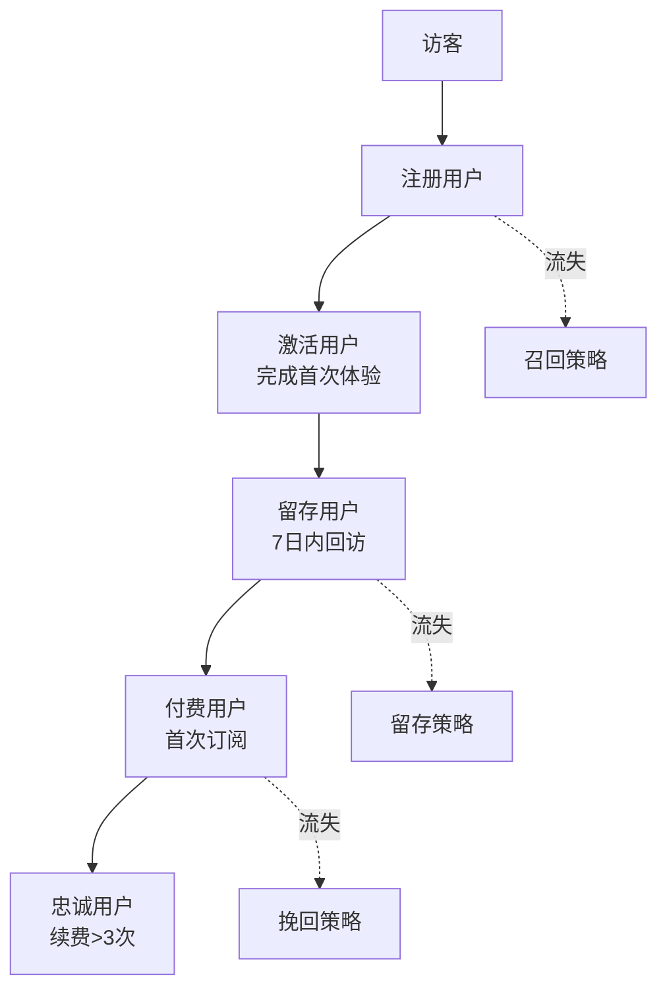

# OrAura 商业与订阅逻辑设计文档

## 📊 文档概述

本文档详细阐述了 OrAura（灵语）的商业模式、订阅系统设计、用户增长策略以及变现逻辑，为产品的商业化运营提供技术架构和实施指导。

---

## 🎯 商业模式概览

### 核心商业逻辑

OrAura 采用**Freemium + 订阅制**的商业模式，通过免费功能吸引用户，通过高价值的会员服务实现变现。

### 价值主张矩阵

| 用户层级     | 核心价值     | 痛点解决           | 付费动机     |
| ------------ | ------------ | ------------------ | ------------ |
| **免费用户** | 基础灵性体验 | 初步情绪疏导       | 好奇心驱动   |
| **付费用户** | 深度个人成长 | 系统性心理健康管理 | 持续改善需求 |
| **重度用户** | 生活方式转变 | 全方位灵性指导     | 依赖性使用   |

---

## 💰 订阅系统架构

### 会员等级设计

#### 1. 免费版（Forever Free）

```
功能限制：
- 每日占卜：1次
- 冥想课程：3个基础课程
- 白噪音：3种声音源
- 日记功能：最多30条记录
- 情绪分析：仅当日数据
- AI分析：基础版本
```

#### 2. 灵语月会员（￥ 28/月）

```
解锁功能：
- 无限制占卜 + 高级牌阵
- 全部冥想课程库
- 15+种白噪音 + 自定义混音
- 无限日记 + AI深度分析
- 30天情绪趋势图谱
- 离线下载功能
- 优先客服支持
```

#### 3. 灵语年会员（￥ 168/年，节省 30%）

```
包含月会员所有功能 + 额外权益：
- 专属冥想课程（年度更新）
- 个性化AI陪伴模型
- 数据导出（PDF/Excel）
- 早鸟新功能体验
- 专属社区访问权限
- 年度灵性成长报告
```

### 订阅定价策略

#### 定价心理学应用

- **锚定效应**：年费显示月均￥ 14，对比月费￥ 28
- **损失厌恶**：免费试用期结束前 48 小时提醒
- **社会证明**：显示"已有 X 万+用户选择年费"

#### 动态定价机制

```typescript
interface PricingStrategy {
  newUser: {
    firstWeekFree: true;
    monthlyDiscount: 0.3; // 首月7折
    yearlyDiscount: 0.4; // 首年6折
  };
  returningUser: {
    winbackOffer: 0.5; // 流失用户召回5折
    loyaltyDiscount: 0.1; // 连续订阅用户9折续费
  };
  seasonal: {
    newYear: 0.35; // 新年特惠
    birthday: 0.2; // 生日月8折
    anniversary: 0.25; // 周年庆7.5折
  };
}
```

---

## 🔄 用户生命周期管理

### 用户转化漏斗



### 关键转化节点

#### 1. 注册 → 激活（目标转化率：70%）

```
触发条件：
- 完成首次占卜
- 听完一段冥想
- 记录第一篇日记

策略：
- 新手引导任务系统
- 完成奖励（解锁特殊内容）
- 个性化推荐算法
```

#### 2. 激活 → 付费（目标转化率：15%）

```
触发时机：
- 免费额度即将用完
- 连续使用7天后
- 特定功能使用高频时

策略：
- 适时付费墙提示
- 限时优惠推送
- 社交分享激励
```

#### 3. 付费 → 续费（目标续费率：75%）

```
关键时间节点：
- 订阅后第7天（习惯养成）
- 订阅后第21天（行为固化）
- 到期前7天（续费提醒）

策略：
- 使用价值提醒
- 数据成长报告
- 续费优惠券
```

---

## 🎁 免费策略与付费墙设计

### 免费功能策略

#### Hook 模型应用

```
触发器(Trigger) → 行动(Action) → 酬赏(Reward) → 投入(Investment)
```

1. **外部触发器**

   - 每日运势推送通知
   - 朋友分享的占卜结果
   - 情绪低落时的冥想提醒

2. **内部触发器**

   - 焦虑时寻求占卜指导
   - 失眠时需要助眠音频
   - 情绪波动时记录心情

3. **可变酬赏**

   - 不同的占卜结果和建议
   - 随机解锁的冥想内容
   - AI 生成的个性化分析

4. **用户投入**
   - 个人日记数据
   - 情绪历史记录
   - 自定义设置偏好

### 付费墙设计原则

#### 软付费墙（推荐使用）

```typescript
interface PaywallStrategy {
  type: "soft";
  triggers: {
    usageLimit: {
      dailyDivination: 1;
      weeklyMeditation: 3;
      monthlyJournal: 30;
    };
    timeBasedReminders: {
      day3: "解锁更多冥想课程";
      day7: "获取完整情绪分析";
      day14: "享受无限制占卜";
    };
    featureTeasing: {
      showPreview: true;
      allowPartialAccess: true;
      emphasizeUpgrade: true;
    };
  };
}
```

#### 付费墙触发时机

1. **自然使用边界**

   - 免费次数用完时
   - 尝试使用高级功能时
   - 查看历史数据时

2. **价值展示时机**
   - 获得优质占卜体验后
   - 冥想带来明显效果后
   - AI 分析特别准确时

---

## 📈 增长策略设计

### 用户获取渠道

#### 1. 有机增长（Organic Growth）

```
内容营销：
- 小红书/抖音：每日塔罗/星座内容
- 微信公众号：深度灵性文章
- B站：冥想教学视频

社交裂变：
- 占卜结果分享奖励
- 邀请好友获得免费天数
- 冥想打卡朋友圈分享
```

#### 2. 付费获取（Paid Acquisition）

```
精准投放渠道：
- 小红书信息流（目标：灵性爱好者）
- 抖音短视频广告（目标：焦虑人群）
- 微信朋友圈（目标：25-35岁女性）

投放素材策略：
- 真实用户体验故事
- 明星/KOL使用见证
- 功能演示短视频
```

#### 3. 合作伙伴（Partnership）

```
战略合作：
- 瑜伽馆/冥想中心线下合作
- 心理咨询机构推荐
- 健康类App交换用户

联合营销：
- 与其他生活方式品牌合作
- 参与相关展会活动
- KOL深度合作推广
```

### 留存优化策略

#### 第一周关键行为

```typescript
interface WeekOneRetention {
  day1: ["完成注册", "首次占卜", "设置通知"];
  day2: ["查看昨日运势", "尝试冥想", "记录心情"];
  day3: ["探索白噪音", "分享结果", "完善资料"];
  day7: ["连续签到奖励", "升级提醒", "社区互动"];
}
```

#### 长期留存机制

```
习惯养成：
- 21天冥想挑战
- 情绪记录打卡
- 每日灵性任务

个性化增强：
- AI学习用户偏好
- 定制化内容推荐
- 个人成长轨迹展示

社交连接：
- 匿名经验分享
- 同城用户活动
- 专题讨论社区
```

---

## 💡 创新变现模式

### 1. 数字商品销售

```
虚拟商品：
- 专属塔罗牌套装（￥9.9-29.9）
- 限定占卜背景主题（￥6.9）
- 个性化AI语音包（￥19.9）
- 专属冥想引导音频（￥12.9）

实体周边：
- 定制塔罗牌（￥99）
- 冥想垫/香薰产品（￥159）
- 能量水晶套装（￥299）
```

### 2. 服务型收费

```
高端服务：
- 1对1 AI深度咨询（￥99/次）
- 专业占卜师人工解读（￥199/次）
- 个性化冥想课程定制（￥299）
- 年度灵性成长规划（￥599）
```

### 3. 企业级服务

```
B2B产品：
- 企业员工心理健康方案
- 团队建设冥想课程
- 公司福利白噪音服务
- 定制化品牌占卜活动
```

---

## 🔍 数据分析与优化

### 关键指标体系（KPI）

#### 用户指标

```typescript
interface UserMetrics {
  acquisition: {
    DAU: number; // 日活跃用户
    MAU: number; // 月活跃用户
    CAC: number; // 获客成本
    registrationRate: number; // 注册转化率
  };
  engagement: {
    sessionDuration: number; // 平均使用时长
    sessionFrequency: number; // 使用频次
    featureAdoption: number; // 功能使用率
    retentionRate: {
      day1: number;
      day7: number;
      day30: number;
    };
  };
  monetization: {
    ARPU: number; // 用户平均收入
    LTV: number; // 用户生命周期价值
    conversionRate: number; // 付费转化率
    churnRate: number; // 流失率
    MRR: number; // 月度重复收入
  };
}
```

#### 业务指标

```typescript
interface BusinessMetrics {
  revenue: {
    totalRevenue: number;
    subscriptionRevenue: number;
    oneTimeRevenue: number;
    revenueGrowthRate: number;
  };
  subscription: {
    newSubscribers: number;
    canceledSubscribers: number;
    renewalRate: number;
    upgradeRate: number; // 月→年升级率
    downgradeRate: number; // 年→月降级率
  };
}
```

### A/B 测试策略

#### 定价优化测试

```
测试变量：
- 价格点：￥19/￥28/￥35（月费）
- 免费试用期：3天/7天/14天
- 续费折扣：10%/20%/30%

测试指标：
- 付费转化率
- 长期留存率
- 平均订阅周期
```

#### 功能解锁策略测试

```
策略A：渐进式解锁（每日增加功能）
策略B：一次性全功能展示
策略C：按需提醒式解锁

衡量标准：
- 用户参与度
- 付费意愿
- 功能使用深度
```

### 用户行为分析

#### 付费用户行为模式

```sql
-- 示例分析查询
SELECT
  user_segment,
  AVG(daily_sessions) as avg_daily_usage,
  AVG(subscription_duration) as avg_subscription_length,
  AVG(ltv) as average_lifetime_value
FROM user_analytics
WHERE subscription_status = 'active'
GROUP BY user_segment
ORDER BY average_lifetime_value DESC;
```

#### 流失预警模型

```python
# 流失风险评分模型
churn_risk_factors = {
    'decreasing_usage': 0.3,      # 使用频率下降
    'feature_abandonment': 0.25,   # 停止使用核心功能
    'subscription_expiry': 0.2,    # 订阅即将到期
    'support_complaints': 0.15,    # 客服投诉
    'competitor_usage': 0.1        # 使用竞品
}
```

---

## 🛡️ 风险控制与合规

### 订阅安全策略

#### 1. 反欺诈机制

```typescript
interface FraudPrevention {
  deviceFingerprinting: boolean; // 设备指纹识别
  behaviorAnalysis: boolean; // 行为模式分析
  paymentValidation: boolean; // 支付信息验证
  velocityChecking: boolean; // 频率异常检测
}
```

#### 2. 退款政策

```
自动退款条件：
- 技术故障导致服务不可用
- 重复扣费（系统错误）
- 未成年人误操作

人工审核退款：
- 用户主观不满意
- 功能与描述不符
- 特殊情况申请
```

### 法律合规要求

#### 数据保护

- 遵循《个人信息保护法》
- GDPR 合规（欧洲用户）
- 明确数据使用条款

#### 订阅透明度

- 清晰的价格展示
- 明确的自动续费提醒
- 简便的取消订阅流程

---

## 📅 实施路线图

### Phase 1: 基础商业化（M1-M3）

```
✅ 核心订阅系统开发
✅ 基础付费墙实现
✅ 支付集成（iOS/Android）
✅ 用户行为数据收集
```

### Phase 2: 优化增长（M4-M6）

```
🔄 A/B测试平台搭建
🔄 个性化推荐系统
🔄 用户留存优化
🔄 社交分享功能
```

### Phase 3: 规模化变现（M7-M12）

```
📈 多元化收入流
📈 企业级产品线
📈 国际化扩展
📈 AI能力商业化
```

---

## 🎯 成功指标与预期

### 6 个月目标

- 注册用户：10 万+
- 付费转化率：8-12%
- 月收入：50 万+
- 用户留存率（30 天）：40%+

### 12 个月目标

- 注册用户：50 万+
- 付费转化率：15%+
- 月收入：300 万+
- 用户留存率（30 天）：60%+

---

_本文档将根据实际运营数据和市场反馈持续优化更新。_
